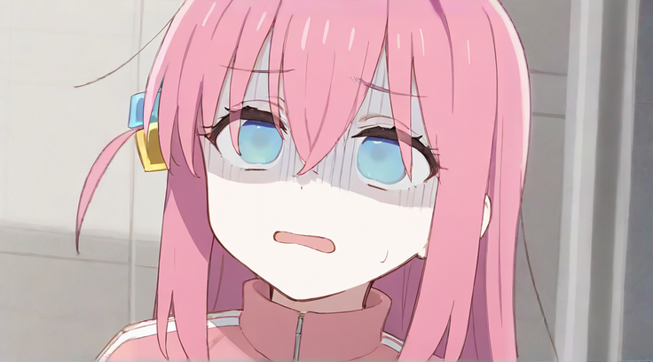
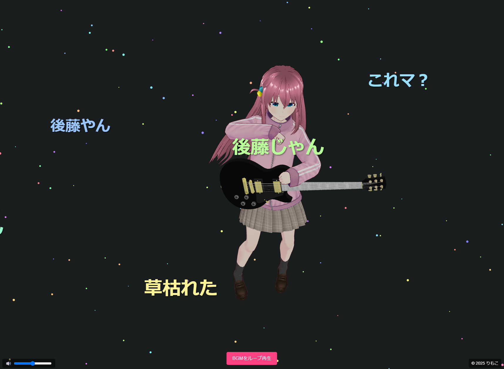

# 🎸 Bocchi VRM - Three.jsでぼっちちゃんを召喚！

  

ぼっちちゃん「え？わたしがギター持って踊るんですか・・・！？」 

**ぼっちは、ぼっちちゃんだけじゃないよ！**  
**わたしもぼっち！ほぼ同じぐらいの年齢でほぼ同じ理由で同じぐらいの練習時間とってギターはじめた同志や！！！**  

・・・という思いが高まったので作ってみた。

## 🚀 プロジェクト概要
Three.js + VRM を使って、ぼっちちゃんを3D空間で動かせるWebアプリ！  
VRMモデルのアニメーション、ダイナミックなカメラワークなどを実装！  

🔗 **デモURL:** [Vercelで実行中！](https://bocchi-v2.vercel.app/)

---

## ✨ 特徴
- 🎮 **Three.js + VRM.js** を活用したリアルタイム3Dアニメーション
- 💃 **ダンスアニメーション** & **ギター演奏モーション** をランダム再生
- 🎥 **動的なカメラワーク** (オートローテート / ドリーズーム / フォーカスシフト)
- 🎵 **BGMとリップシンク連携** (口パク)
- 🔊 **ボリュームコントロール & UIエフェクト**

---

## 📸 スクリーンショット


---

## 🔧 インストール & セットアップ
### **1️⃣ クローン & インストール**
```sh
# リポジトリをクローン
git clone https://github.com/limonene213u/bocchi-v2
cd bocchi-vrm

# 必要なパッケージをインストール
npm install
```

### **2️⃣ ローカルで実行**
```sh
npm run dev
```
ブラウザで `http://localhost:5173` を開く！

### **3️⃣ Vercelデプロイ (オプション)**
```sh
vercel deploy --prod
```

---

## 📂 ディレクトリ構成
```
📂 bocchi-v2/
├── 📂 public/            # VRMモデル, 音楽ファイルなど
│   └── 📂 vrma     # モーションファイル
├── 📂 src/               # ソースコード
│   ├── 📜 bocchi_v2.js     # メインスクリプト
│   ├── 📜 cameraControls.js # カメラワーク処理
│   ├── 📜 bgm.js        # BGM & リップシンク処理
│   ├── 📜 particles.js  # パーティクルエフェクト
│   ├── 📜 comments.js   # 流れるコメント機能
│   └── 📜 style.css     # スタイルシート
├── 📜 index.html        # メインHTML
├── 📜 vite.config.js    # Vite設定
└── 📜 README.md         # このファイル！
```

---

## ⭐ 貢献・フィードバック歓迎！
興味があれば **スター⭐ & フォーク** よろしくにゃん！
IssueやPRも大歓迎！🐾

```sh
# GitHubでスターをつけよう！
https://github.com/limonene213u/bocchi-v2
```

🐾 **キミもぼっちちゃんをブラウザで動かそう！** 🎸🔥
---

## 🎯 目標 & 今後の開発

表情 & 口パクの向上 - 音声認識で動くように

スマホ対応 - モバイル環境最適化

カスタムモーション追加 - ライブモーションの実装

## 📢 SNSでシェアしよう！

#ぼっちちゃんVRM #BocchiTheRockVRM でツイートしてくれると嬉しいです！🐾

  

かわいい。  

---
🛠️ 使用技術

Three.js - 3Dレンダリング

VRM (Pixiv/Three-VRM) - 3Dキャラクターの表現

GSAP - カメラワークのアニメーション

Vercel - デプロイ環境

PixAI - 一部素材の生成

Vite - ビルドツール

<br>

🎵 クレジット & リスペクト

🔹 開発者

りもこ - [X(Twitter)](https://x.com/limonene_citrus) / [GitHub](https://github.com/limonene213u)

3Dモデル制作 / システム開発 / BGM制作


🔹 オマージュ & インスパイア元

『ぼっち・ざ・ろっく！』 - 原作: はまじあき 先生

BGM: 『シカ色デイズ』オマージュ（ギター：りもこ）

PixAI: 一部素材の生成

<br>

🔹 ライブラリ & ツール

Three.js - 公式サイト

Pixiv/Three-VRM - 公式リポジトリ

GSAP - 公式サイト

---

## ⚖ ライセンス
このプロジェクトは **MITライセンス** のもとで公開されています。

© 2025 りもこ

---

© はまじあき / 芳文社・アニプレックス・ぼっち・ざ・ろっく！製作委員会

※このプロジェクトはファンメイドの作品であり、公式とは関係ありません。